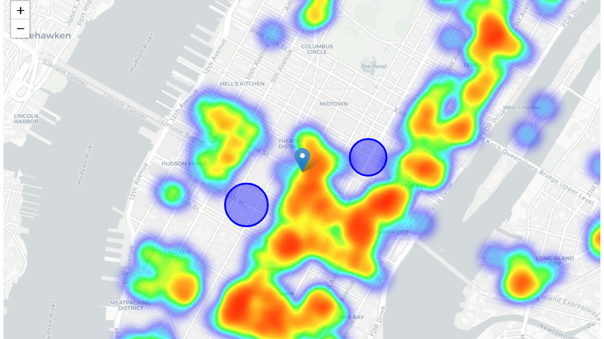

# Locations_to_Open_an_Indian_Restaurant_in_NewYork

### P.S. Folium maps are not loading on github. To see the maps you have to run the notebook on your preferred environment and don't forget to make the notebook `Trusted`.

 

Starting a restaurant business is no less than a herculean task. In a market where everybody wants to open a restaurant there are few things which restaurateurs have to keep in mind before starting up the business which includes cuisine, ambience, quality, services and location. Choosing a happening place could help restaurateurs keep an upper hand in the market. A happening place would grant you with happening consumers. Not everyone belongs to everywhere. Same, not every place is for restaurant. It is really difficult than some people think it might. A place could take you to the heights or could even turn into dud. Like, how would you reach to the consumers if it’s not in the right place? No consumers mean No business. It is as straight as that.

In this work, we will try to find an optimal location for a restaurant. Specifically, this report will be targeted to stakeholders interested in opening an Indian restaurant in New York.

Since there are lots of restaurants in New York we will try to detect locations that are not already crowded with restaurants. We are also particularly interested in areas with no Indian restaurants. We would also prefer locations as close to city center as possible, assuming that first two conditions are met.

We will use our data science powers to generate a few most promissing neighborhoods based on this criteria as shown in the map visualisation below.

### Thanks for Reading! 
